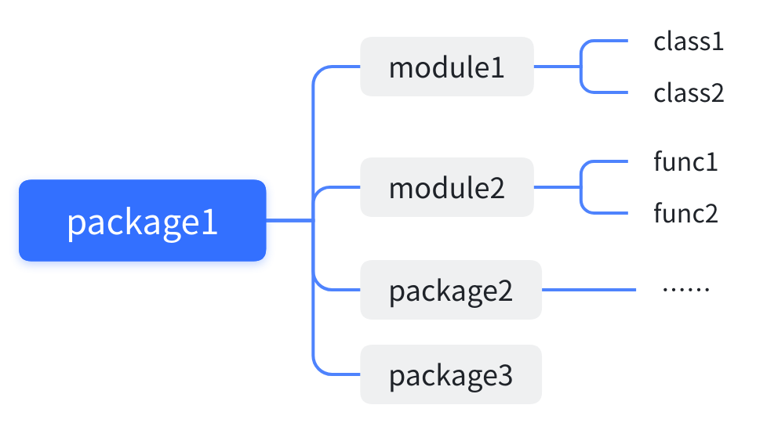
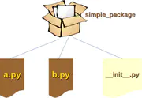

## 【python】Package和类
### 1. Package
#### 1.1 前言
1. python 是通过module组织代码的，每一个module就是一个python文件
2. modules是通过package来组织的
 

#### 1.2 定义
package的定义很简单，在当面目录下有`__init__.py`文件的目录即为一个package  
 
> 一个package 被导入，不管在什么时候__init__.py的代码都只会被执行一次

```python
sound                                       Top-level package
|-- effects                                 Subpackage for sound effects
|   |-- echo.py
|   |-- __init__.py
|   |-- reverse.py
|   `-- surround.py
|-- filters                                Subpackage for filters
|   |-- equalizer.py
|   |-- __init__.py
|   |-- karaoke.py
|   `-- vocoder.py
|-- formats                                Subpackage for file format conversions
|   |-- aiffread.py
|   |-- aiffwrite.py
|   |-- auread.py
|   |-- auwrite.py
|   |-- __init__.py
|   |-- wavread.py
|   `-- wavwrite.py
`-- __init__.py                            Initialize the sound package

```

```Python
from sound.effects import reverse
```

> . 代表当前目录  
.. 代表父级目录  
```python
from .echo import func1 as f1  # 等价于 from sound.effects.echo import func1 as f1  
```

### 2. 类
#### 2.1 作用
1.  类把数据与功能绑定在一起。
2.  创建新类就是创建新的对象 类型，从而创建该类型的新 实例 。
3.  类实例具有多种保持自身状态的属性。
4.  类实例还支持（由类定义的）修改自身状态的方法。

#### 2.2 名称和对象
对象之间相互独立，多个名称（在多个作用域内）可以绑定到同一个对象
##### 命名空间（Namespace）

命名空间是一个存储变量名称（标识符）与其对应对象的映射关系的容器。可以把命名空间看作是一个字典，其中键是变量名（字符串），值是对象的引用。命名空间的主要类型包括：

1. **内置命名空间**：包含 Python 内置的函数和变量，如 `print()`、`len()` 等。这个命名空间在 Python 解释器启动时创建，持续到解释器退出。
   
2. **全局命名空间**：模块级别的命名空间，包含模块中定义的所有全局变量和函数。模块加载时创建，模块结束时销毁。

3. **局部命名空间**：在函数或方法内部定义的命名空间，包含该函数内部的变量。每当函数被调用时，都会创建一个新的局部命名空间，函数执行结束后该命名空间就被销毁。

4. **闭包命名空间**：在嵌套函数中，内层函数可以访问外层函数的变量。

##### 作用域（Scope）

作用域是指程序中变量的可访问性和可见性。根据作用域，可以确定变量名在特定上下文中的生存期和可见性。Python 中的作用域主要分为以下几种：

1. **局部作用域（Local Scope）**：函数内部的作用域。函数内部定义的变量只能在函数内访问。

2. **嵌套作用域（Enclosing Scope）**：当一个函数在另一个函数内部定义时，内层函数可以访问外层函数的变量。

3. **全局作用域（Global Scope）**：在模块的顶层定义的变量，可以在模块的任何地方访问。全局变量的作用域是整个模块。

4. **内置作用域（Built-in Scope）**：Python 内置的名字，属于全局作用域，随时可以访问。例如，`int`、`str` 等。

##### LEGB 原则

Python 中的作用域遵循一个名为 LEGB 的规则，表示查找变量时遵循的顺序：

- **L**ocal（局部作用域）：首先在局部作用域查找。
- **E**ncoding（嵌套作用域）：如果在局部找不到，则查找任何包含此函数的外层函数的作用域。
- **G**lobal（全局作用域）：如果在局部和嵌套作用域找不到，则查找全局作用域。
- **B**uilt-in（内置作用域）：最后查找内置作用域。

```Python
def scope_test():
    def do_local():
        spam = "local spam"

    def do_nonlocal():
        nonlocal spam
        spam = "nonlocal spam"

    def do_global():
        global spam
        spam = "global spam"

    spam = "test spam"
    do_local()
    print("After local assignment:", spam)
    do_nonlocal()
    print("After nonlocal assignment:", spam)
    do_global()
    print("After global assignment:", spam)
scope_test()
print("In global scope:", spam)
```

```Python
After local assignment: test spam
After nonlocal assignment: nonlocal spam
After global assignment: nonlocal spam
In global scope: global spam
```
---

```python
def outer_function():
    outer_var = "我是外层变量"  # 外层函数的局部变量

    def middle_function():
        middle_var = "我是中层变量"  # 中层函数的局部变量

        def inner_function():
            inner_var = "我是内层变量"  # 内层函数的局部变量

            def innermost_function():
                nonlocal outer_var  # 这是直接外层函数的变量
                outer_var = "外层变量已被内层函数修改"
                print("内层函数中:", inner_var)
                print("中层变量:", middle_var)
                print("外层变量:", outer_var)  # 仍然可以访问外层变量，但不能修改

            innermost_function()

        inner_function()

    middle_function()
    print("外层函数中:", outer_var)  # 外层变量保持不变

outer_function()
```

```python
内层函数中: 我是内层变量
中层变量: 我是中层变量
外层变量: 外层变量已被内层函数修改
外层函数中: 外层变量已被内层函数修改
```

#### 2.4 定义
```Python
class ClassName:
    
    def __init__(self):
        pass
        
    def func1(self):
        pass
```

#### 2.5 类对象
#### 2.5.1 属性引用
> 属性引用 使用 Python 中所有属性引用所使用的标准语法: obj.name。 有效的属性名称是类对象被创建时存在于类命名空间中的所有名称。

```Python
class MyClass:
    """A simple example class"""
    i = 12345

    def f(self):
        return 'hello world'
```
1.  `MyClass.i` 和 `MyClass.f` 就是有效的属性引用，将分别返回一个整数和一个函数对象  
2.  类属性也可以被赋值，可以通过赋值来更改 MyClass.i 的值  


##### 2.5.2 实例化
> 类的 实例化 使用函数表示法。 可以把类对象视为是返回该类的一个新实例的不带参数的函数

`x = MyClass()`创建类的新 实例 并将此对象分配给局部变量 x

#### 2.6 实例对象
1.  实例对象所能理解的唯一操作是属性引用。 有两种有效的属性名称：数据属性和方法。   
2.  数据属性不需要声明；像局部变量一样，它们将在第一次被赋值时产生。   
3.  方法是“从属于”对象的函数。   
4.  实例对象的有效方法名称依赖于其所属的类。 根据定义，一个类中所有是函数对象的属性都是定义了其实例的相应方法。 因此在我们的示例中，`x.f` 是有效的方法引用，因为 `MyClass.f `是一个函数，而 `x.i` 不是方法，因为 `MyClass.i` 不是函数。 但是 `x.f` 与 `MyClass.f` 并不是一回事 --- 它是一个 方法对象，不是函数对象。   
#### 2.7 类变量和实例变量
1.  实例变量用于每个实例的唯一数据
2.  类变量用于类的所有实例共享的属性和方法（对象例如列表和字典的时候导致令人惊讶的结果）
3.  如果同样的属性名称同时出现在实例和类中，则属性查找会优先选择实例

```Python
class Dog:
    kind = 'canine'         # class variable shared by all instances
    count = 1
    action = []
    action2 = {}
    def __init__(self, name):
        self.name = name    # instance variable unique to each instance
```


#### 2.8 面向对象编程（OOP）原则
##### 1. 封装（Encapsulation）

**封装**是指将数据（属性）和行为（方法）封装在对象内部，并通过访问控制来保护数据的完整性。

###### 示例：
```python
class BankAccount:
    def __init__(self, account_holder, balance):
        self.account_holder = account_holder
        self.__balance = balance  # 私有属性

    def deposit(self, amount):
        if amount > 0:
            self.__balance += amount
        else:
            print("存款金额必须大于0。")

    def withdraw(self, amount):
        if 0 < amount <= self.__balance:
            self.__balance -= amount
        else:
            print("取款金额无效或余额不足。")

    def get_balance(self):
        return self.__balance  # 通过公共方法访问私有属性

# 创建一个账户
account = BankAccount("Alice", 1000)

# 存款
account.deposit(500)

# 取款
account.withdraw(200)

# 获取账户余额
print("账户余额:", account.get_balance())

# 尝试直接访问私有属性（会失败）
# print(account.__balance)  # 这会抛出一个AttributeError
```

**说明**：
- `__balance`是私有属性，外部无法直接访问它，只能通过`get_balance`方法来获取余额。这是封装的典型应用，通过隐藏内部实现细节来保护数据的完整性。

##### 2. 继承（Inheritance）

**继承**允许一个类继承另一个类的属性和方法，从而实现代码复用和扩展。

###### 示例：
```python
class Animal:
    def __init__(self, name):
        self.name = name

    def speak(self):
        pass  # 定义一个通用的方法接口

class Dog(Animal):
    def speak(self):
        return f"{self.name} says Woof!"

class Cat(Animal):
    def speak(self):
        return f"{self.name} says Meow!"

# 创建Dog和Cat对象
dog = Dog("Buddy")
cat = Cat("Whiskers")

# 调用继承自Animal类的speak方法
print(dog.speak())
print(cat.speak())
```

**说明**：
- `Dog`和`Cat`类继承了`Animal`类的属性和方法。`Dog`和`Cat`分别重写了`Animal`类中的`speak`方法，这展示了如何通过继承来扩展和定制父类的功能。

##### 3. 多态（Polymorphism）

**多态**指的是同一方法在不同对象上可以有不同的表现形式。

###### 示例：
```python
class Animal:
    def speak(self):
        pass

class Dog(Animal):
    def speak(self):
        return "Woof!"

class Cat(Animal):
    def speak(self):
        return "Meow!"

def make_animal_speak(animal):
    print(animal.speak())

# 多态的体现
animals = [Dog(), Cat()]
for animal in animals:
    make_animal_speak(animal)
```

**说明**：
- `make_animal_speak`函数可以接受任何继承自`Animal`的对象，并调用其`speak`方法。这是多态的体现——不同的对象可以通过相同的接口（`speak`方法）表现出不同的行为。

##### 4. 抽象（Abstraction）

**抽象**是指通过定义抽象类或接口，隐藏对象的具体实现，仅暴露使用对象所需的接口。

###### 示例：
```python
from abc import ABC, abstractmethod

class Shape(ABC):
    @abstractmethod
    def area(self):
        pass

    @abstractmethod
    def perimeter(self):
        pass

class Rectangle(Shape):
    def __init__(self, width, height):
        self.width = width
        self.height = height

    def area(self):
        return self.width * self.height

    def perimeter(self):
        return 2 * (self.width + self.height)

class Circle(Shape):
    def __init__(self, radius):
        self.radius = radius

    def area(self):
        return 3.14 * self.radius ** 2

    def perimeter(self):
        return 2 * 3.14 * self.radius

# 使用抽象类
shapes = [Rectangle(2, 3), Circle(5)]

for shape in shapes:
    print("Area:", shape.area())
    print("Perimeter:", shape.perimeter())
```

**说明**：
- `Shape`类是一个抽象类，它定义了`area`和`perimeter`两个抽象方法，任何继承`Shape`的类都必须实现这些方法。`Rectangle`和`Circle`类分别实现了这些方法，这样一来，用户只需关心`area`和`perimeter`方法，而不必了解其具体实现细节。


#### 2.9 面向对象设计原则（SOLID）

##### 1. 单一职责原则（Single Responsibility Principle, SRP）

**定义**：一个类应该只有一个导致其变化的原因。换句话说，一个类只应该有一个职责，即仅负责一件事。

**示例**：
```python
class Report:
    def __init__(self, data):
        self.data = data

    def generate_report(self):
        return f"Report data: {self.data}"

class ReportPrinter:
    def print_report(self, report):
        print(report.generate_report())

# 使用
data = "Some important data"
report = Report(data)
printer = ReportPrinter()
printer.print_report(report)
```

**说明**：
- `Report`类负责报告的生成，而`ReportPrinter`类负责报告的打印。这符合单一职责原则，因为每个类只有一个职责：生成报告或打印报告。

##### 2. 开放封闭原则（Open/Closed Principle, OCP）

**定义**：软件实体（类、模块、函数等）应该对扩展开放，对修改封闭。换句话说，应该通过扩展类来实现新功能，而不是通过修改已有的代码。

**示例**：
```python
from abc import ABC, abstractmethod

class Shape(ABC):
    @abstractmethod
    def area(self):
        pass

class Rectangle(Shape):
    def __init__(self, width, height):
        self.width = width
        self.height = height

    def area(self):
        return self.width * self.height

class Circle(Shape):
    def __init__(self, radius):
        self.radius = radius

    def area(self):
        return 3.14 * self.radius ** 2

def calculate_area(shapes):
    total_area = 0
    for shape in shapes:
        total_area += shape.area()
    return total_area

# 使用
shapes = [Rectangle(3, 4), Circle(5)]
print("Total area:", calculate_area(shapes))
```

**说明**：
- `Shape`类是一个抽象类，`Rectangle`和`Circle`类继承并实现了`Shape`的`area`方法。现在，如果我们需要添加新的形状，只需要扩展`Shape`类，而不需要修改现有的代码，这符合开放封闭原则。

##### 3. 里氏替换原则（Liskov Substitution Principle, LSP）

**定义**：子类对象必须能够替换掉父类对象，且保证程序行为的正确性。换句话说，子类应该能够在不改变程序正确性的前提下替换其父类。

**示例**：
```python
class Bird:
    def fly(self):
        return "Flying"

class Sparrow(Bird):
    pass

class Ostrich(Bird):
    def fly(self):
        raise Exception("Ostrich cannot fly")

def make_bird_fly(bird: Bird):
    return bird.fly()

# 使用
sparrow = Sparrow()
print(make_bird_fly(sparrow))

ostrich = Ostrich()
# print(make_bird_fly(ostrich))  # 这会导致异常，不符合LSP
```

**说明**：
- `Ostrich`类虽然继承了`Bird`类，但由于其重写的`fly`方法不符合父类的行为（因为鸵鸟不能飞），它不能被当作`Bird`类的实例来替换。这违反了里氏替换原则。

##### 4. 接口隔离原则（Interface Segregation Principle, ISP）

**定义**：不应该强迫类实现它们不使用的方法。换句话说，接口应该尽量小，并根据具体的功能进行拆分。

**示例**：
```python
from abc import ABC, abstractmethod

class Workable(ABC):
    @abstractmethod
    def work(self):
        pass

class Eatable(ABC):
    @abstractmethod
    def eat(self):
        pass

class Worker(Workable, Eatable):
    def work(self):
        return "Working hard!"

    def eat(self):
        return "Eating lunch!"

class Robot(Workable):
    def work(self):
        return "Working non-stop!"

# 使用
worker = Worker()
robot = Robot()

print(worker.work())
print(worker.eat())
print(robot.work())
```

**说明**：
- `Workable`和`Eatable`接口将“工作”和“吃饭”的行为分开。`Robot`只实现了`Workable`接口，因为它不需要“吃饭”的功能。这符合接口隔离原则，避免了类被强迫实现不需要的方法。

##### 5. 依赖倒置原则（Dependency Inversion Principle, DIP）

**定义**：高层模块不应该依赖于低层模块，二者都应该依赖于抽象。抽象不应该依赖于具体实现，具体实现应该依赖于抽象。

**示例**：
```python
from abc import ABC, abstractmethod

class DatabaseConnection(ABC):
    @abstractmethod
    def connect(self):
        pass

class MySQLConnection(DatabaseConnection):
    def connect(self):
        return "Connecting to MySQL"

class PostgreSQLConnection(DatabaseConnection):
    def connect(self):
        return "Connecting to PostgreSQL"

class DataManager:
    def __init__(self, db_connection: DatabaseConnection):
        self.db_connection = db_connection

    def get_data(self):
        return self.db_connection.connect()

# 使用
mysql_conn = MySQLConnection()
postgres_conn = PostgreSQLConnection()

data_manager = DataManager(mysql_conn)
print(data_manager.get_data())

data_manager = DataManager(postgres_conn)
print(data_manager.get_data())
```

**说明**：
- `DataManager`类依赖于抽象的`DatabaseConnection`接口，而不是具体的数据库实现。这样可以很容易地切换数据库，而不需要修改`DataManager`类的代码。这就是依赖倒置原则的应用。
