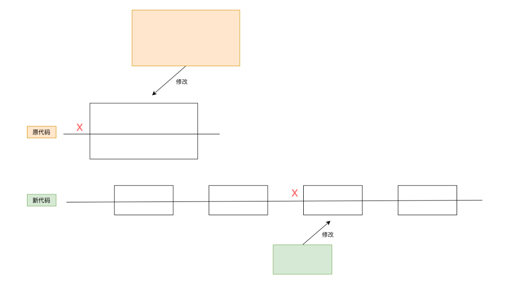
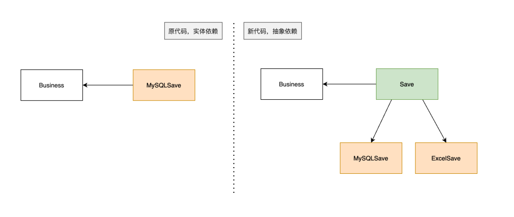
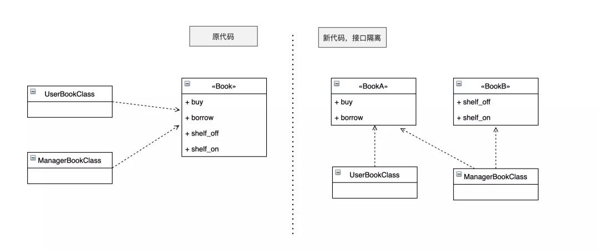
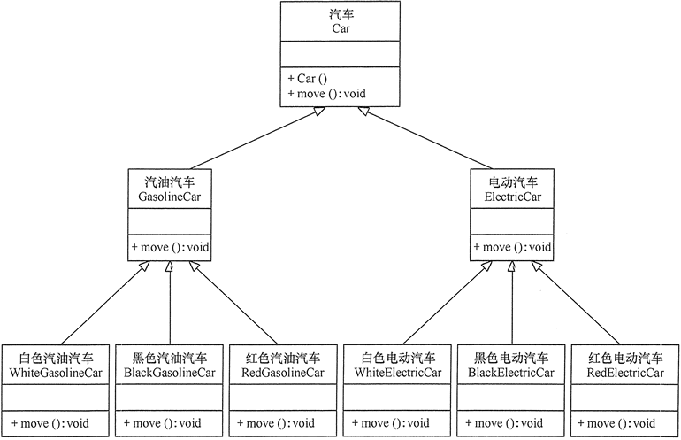

## 【python】Package和类
### 1. Package
#### 1.1 前言
1. python 是通过module组织代码的，每一个module就是一个python文件
2. modules是通过package来组织的
 

#### 1.2 定义
package的定义很简单，在当面目录下有`__init__.py`文件的目录即为一个package  
 
> 一个package 被导入，不管在什么时候__init__.py的代码都只会被执行一次

```python
sound                                       Top-level package
|-- effects                                 Subpackage for sound effects
|   |-- echo.py
|   |-- __init__.py
|   |-- reverse.py
|   `-- surround.py
|-- filters                                Subpackage for filters
|   |-- equalizer.py
|   |-- __init__.py
|   |-- karaoke.py
|   `-- vocoder.py
|-- formats                                Subpackage for file format conversions
|   |-- aiffread.py
|   |-- aiffwrite.py
|   |-- auread.py
|   |-- auwrite.py
|   |-- __init__.py
|   |-- wavread.py
|   `-- wavwrite.py
`-- __init__.py                            Initialize the sound package

```

```Python
from sound.effects import reverse
```

> . 代表当前目录  
.. 代表父级目录  
```python
from .echo import func1 as f1  # 等价于 from sound.effects.echo import func1 as f1  
```

### 2. 类
#### 2.1 作用
1.  类把数据与功能绑定在一起。
2.  创建新类就是创建新的对象 类型，从而创建该类型的新 实例 。
3.  类实例具有多种保持自身状态的属性。
4.  类实例还支持（由类定义的）修改自身状态的方法。

#### 2.2 名称和对象
对象之间相互独立，多个名称（在多个作用域内）可以绑定到同一个对象
#### 2.3 python的作用域和命名空间
1.  namespace （命名空间）是一个从名字到对象的映射  
+ 当前大部分命名空间都由 Python 字典实现，但一般情况下基本不会去关注它们（除了要面对性能问题时），而且也有可能在将来更改。  
+ 几个命名空间的例子：存放内置函数的集合（包含 abs() 这样的函数，和内建的异常等）；模块中的全局名称；函数调用中的局部名称.  
+ 不同命名空间中的名称之间绝对没有关系；例如，两个不同的模块都可以定义一个 maximize 函数而不会产生混淆 --- 模块的用户必须在其前面加上模块名称。
2.  命名空间在不同时刻被创建，拥有不同的生存期。  
+ 包含内置名称的命名空间是在 Python 解释器启动时创建的，永远不会被删除  
+ 模块的全局命名空间在模块定义被读入时创建  
+ 一个函数的本地命名空间在这个函数被调用时创建
3.  一个`作用域`是一个命名空间可直接访问的 Python 程序的文本区域  
+ 最先搜索的最内部作用域包含局部名称  
+ 从最近的封闭作用域开始搜索的任何封闭函数的作用域包含非局部名称，也包括非全局名称  
+ 倒数第二个作用域包含当前模块的全局名称  
+ 最外面的作用域（最后搜索）是包含内置名称的命名空间

```Python
def scope_test():
    def do_local():
        spam = "local spam"

    def do_nonlocal():
        nonlocal spam
        spam = "nonlocal spam"

    def do_global():
        global spam
        spam = "global spam"

    spam = "test spam"
    do_local()
    print("After local assignment:", spam)
    do_nonlocal()
    print("After nonlocal assignment:", spam)
    do_global()
    print("After global assignment:", spam)
scope_test()
print("In global scope:", spam)
```

```Python
After local assignment: test spam
After nonlocal assignment: nonlocal spam
After global assignment: nonlocal spam
In global scope: global spam
```
---

```python
def outer_function():
    outer_var = "我是外层变量"  # 外层函数的局部变量

    def middle_function():
        middle_var = "我是中层变量"  # 中层函数的局部变量

        def inner_function():
            inner_var = "我是内层变量"  # 内层函数的局部变量

            def innermost_function():
                nonlocal outer_var  # 这是直接外层函数的变量
                outer_var = "外层变量已被内层函数修改"
                print("内层函数中:", inner_var)
                print("中层变量:", middle_var)
                print("外层变量:", outer_var)  # 仍然可以访问外层变量，但不能修改

            innermost_function()

        inner_function()

    middle_function()
    print("外层函数中:", outer_var)  # 外层变量保持不变

outer_function()
```

```python
内层函数中: 我是内层变量
中层变量: 我是中层变量
外层变量: 外层变量已被内层函数修改
外层函数中: 外层变量已被内层函数修改
```

#### 2.4 定义
```Python
class ClassName:
    
    def __init__(self):
        pass
        
    def func1(self):
        pass
```

#### 2.5 类对象
#### 2.5.1 属性引用
> 属性引用 使用 Python 中所有属性引用所使用的标准语法: obj.name。 有效的属性名称是类对象被创建时存在于类命名空间中的所有名称。

```Python
class MyClass:
    """A simple example class"""
    i = 12345

    def f(self):
        return 'hello world'
```
1.  `MyClass.i` 和 `MyClass.f` 就是有效的属性引用，将分别返回一个整数和一个函数对象  
2.  类属性也可以被赋值，可以通过赋值来更改 MyClass.i 的值  


##### 2.5.2 实例化
> 类的 实例化 使用函数表示法。 可以把类对象视为是返回该类的一个新实例的不带参数的函数

`x = MyClass()`创建类的新 实例 并将此对象分配给局部变量 x

#### 2.6 实例对象
1.  实例对象所能理解的唯一操作是属性引用。 有两种有效的属性名称：数据属性和方法。   
2.  数据属性不需要声明；像局部变量一样，它们将在第一次被赋值时产生。   
3.  方法是“从属于”对象的函数。   
4.  实例对象的有效方法名称依赖于其所属的类。 根据定义，一个类中所有是函数对象的属性都是定义了其实例的相应方法。 因此在我们的示例中，`x.f` 是有效的方法引用，因为 `MyClass.f `是一个函数，而 `x.i` 不是方法，因为 `MyClass.i` 不是函数。 但是 `x.f` 与 `MyClass.f` 并不是一回事 --- 它是一个 方法对象，不是函数对象。   
#### 2.7 类变量和实例变量
1.  实例变量用于每个实例的唯一数据
2.  类变量用于类的所有实例共享的属性和方法（对象例如列表和字典的时候导致令人惊讶的结果）
3.  如果同样的属性名称同时出现在实例和类中，则属性查找会优先选择实例

```Python
class Dog:
    kind = 'canine'         # class variable shared by all instances
    count = 1
    action = []
    action2 = {}
    def __init__(self, name):
        self.name = name    # instance variable unique to each instance
```

#### 2.8 继承、多重继承
1. 继承是面向对象编程的一个重要的方式，因为通过继承，子类就可以扩展父类的功能。
2. 举个例子  

    2.1 如果按照哺乳动物和鸟类归类，我们可以设计出这样的类的层次：  
```python

                ┌───────────────┐
                │    Animal     │
                └───────────────┘
                        │
           ┌────────────┴────────────┐
           │                         │
           ▼                         ▼
    ┌─────────────┐           ┌─────────────┐
    │   Mammal    │           │    Bird     │
    └─────────────┘           └─────────────┘
           │                         │
     ┌─────┴──────┐            ┌─────┴──────┐
     │            │            │            │
     ▼            ▼            ▼            ▼
┌─────────┐  ┌─────────┐  ┌─────────┐  ┌─────────┐
│   Dog   │  │   Bat   │  │ Parrot  │  │ Ostrich │
└─────────┘  └─────────┘  └─────────┘  └─────────┘
```

    2.2 但是如果按照“能跑”和“能飞”来归类，我们就应该设计出这样的类的层次   
```python
                ┌───────────────┐
                │    Animal     │
                └───────────────┘
                        │
           ┌────────────┴────────────┐
           │                         │
           ▼                         ▼
    ┌─────────────┐           ┌─────────────┐
    │  Runnable   │           │   Flyable   │
    └─────────────┘           └─────────────┘
           │                         │
     ┌─────┴──────┐            ┌─────┴──────┐
     │            │            │            │
     ▼            ▼            ▼            ▼
┌─────────┐  ┌─────────┐  ┌─────────┐  ┌─────────┐
│   Dog   │  │ Ostrich │  │ Parrot  │  │   Bat   │
└─────────┘  └─────────┘  └─────────┘  └─────────┘

```

    2.3 如果要把上面的两种分类都包含进来，我们就得设计更多的层次：  

    哺乳类：能跑的哺乳类，能飞的哺乳类；
    鸟类：能跑的鸟类，能飞的鸟类。
    这么一来，类的层次就复杂了：
```python
                ┌───────────────┐
                │    Animal     │
                └───────────────┘
                        │
           ┌────────────┴────────────┐
           │                         │
           ▼                         ▼
    ┌─────────────┐           ┌─────────────┐
    │   Mammal    │           │    Bird     │
    └─────────────┘           └─────────────┘
           │                         │
     ┌─────┴──────┐            ┌─────┴──────┐
     │            │            │            │
     ▼            ▼            ▼            ▼
┌─────────┐  ┌─────────┐  ┌─────────┐  ┌─────────┐
│  MRun   │  │  MFly   │  │  BRun   │  │  BFly   │
└─────────┘  └─────────┘  └─────────┘  └─────────┘
     │            │            │            │
     │            │            │            │
     ▼            ▼            ▼            ▼
┌─────────┐  ┌─────────┐  ┌─────────┐  ┌─────────┐
│   Dog   │  │   Bat   │  │ Ostrich │  │ Parrot  │
└─────────┘  └─────────┘  └─────────┘  └─────────┘

```

    如果要再增加“宠物类”和“非宠物类”，这么搞下去，类的数量会呈指数增长，很明显这样设计是不行的。
    
    **正确的做法是采用多重继承**。


3. 多重继承

首先，主要的类层次仍按照哺乳类和鸟类设计：
```python
class Animal(object):
    pass

# 大类:
class Mammal(Animal):
    pass

class Bird(Animal):
    pass

# 各种动物:
class Dog(Mammal):
    pass

class Bat(Mammal):
    pass

class Parrot(Bird):
    pass

class Ostrich(Bird):
    pass

```

现在，我们要给动物再加上Runnable和Flyable的功能，只需要先定义好Runnable和Flyable的类：

```python
class Runnable(object):
    def run(self):
        print('Running...')

class Flyable(object):
    def fly(self):
        print('Flying...')

```

``` python
# 对于需要Runnable功能的动物，就多继承一个Runnable，例如Dog：
class Dog(Mammal, Runnable):
    pass
# 对于需要Flyable功能的动物，就多继承一个Flyable，例如Bat：

class Bat(Mammal, Flyable):
    pass
# 通过多重继承，一个子类就可以同时获得多个父类的所有功能。
```

4. MixIn
在设计类的继承关系时，通常，主线都是单一继承下来的，例如，Ostrich继承自Bird。但是，如果需要“混入”额外的功能，通过多重继承就可以实现，比如，让Ostrich除了继承自Bird外，再同时继承Runnable。这种设计通常称之为MixIn。

为了更好地看出继承关系，我们把Runnable和Flyable改为RunnableMixIn和FlyableMixIn。类似的，你还可以定义出肉食动物CarnivorousMixIn和植食动物HerbivoresMixIn，让某个动物同时拥有好几个MixIn：

```python
class Dog(Mammal, RunnableMixIn, CarnivorousMixIn):
    pass
```
MixIn的目的就是给一个类增加多个功能，这样，在设计类的时候，我们优先考虑通过多重继承来组合多个MixIn的功能，而不是设计多层次的复杂的继承关系。

#### 2.9 面向对象基本原则
1.  单一职责原则；
 
 
2.  开放封闭原则；  
a.  开放指的是对扩展开放，封闭指的是对修改封闭  
b.  较少的改动或者不改动即视为稳定，稳定意味着调用这个对象的其它代码拿到的结果是可以确定的，整体是稳定的。  
```Python
class MySQLSave:

    def __init__(self):
        pass

    def insert(self):
        pass

    def update(self):
        pass


class Business:
    def __init__(self):
        pass

    def save(self):
        saver = MySQLSave()
        saver.insert()
```

```Python
import abc


class Save(metaclass=abc.ABCMeta):
    @abc.abstractmethod
    def insert(self):
        pass

    @abc.abstractmethod
    def update(self):
        pass


class MySQLSave(Save):

    def __init__(self):
        self.classify = "mysql"
        pass

    def insert(self):
        pass

    def update(self):
        pass


class Excel(Save):
    def __init__(self):
        self.classify = "excel"

    def insert(self):
        pass

    def update(self):
        pass


class Business:
    def __init__(self, saver):
        self.saver = saver

    def insert(self):
        self.saver.insert()

    def update(self):
        self.saver.update()


if __name__ == "__main__":
    mysql_saver = MySQLSave()
    excel_saver = Excel()
    business = Business(mysql_saver)
```
 

3.  接口隔离原则；  
a.  调用方不应该依赖它不需要的接口；  
b.  依赖关系应当建立在最小接口上；  
 

 
4.  合成复用原则(组合/聚合复用原则)；  
尽量使用对象组合，而不是继承来达到复用的目的。合成复用的作用是降低对象之间的依赖，因为继承是强依赖关系，无论子类使用到父类的哪几个属性，子类都需要完全拥有父类。合成采用另一种方式实现对象之间的关联，降低依赖关系


4.1 合成复用原则的重要性
4.1.1 通常类的复用分为继承复用和合成复用两种，继承复用虽然有简单和易实现的优点，但它也存在以下缺点。  
+ 继承复用破坏了类的封装性。因为继承会将父类的实现细节暴露给子类，父类对子类是透明的，所以这种复用又称为“白箱”复用。  
+ 子类与父类的耦合度高。父类的实现的任何改变都会导致子类的实现发生变化，这不利于类的扩展与维护。  
+ 它限制了复用的灵活性。从父类继承而来的实现是静态的，在编译时已经定义，所以在运行时不可能发生变化。  

4.1.2 采用组合或聚合复用时，可以将已有对象纳入新对象中，使之成为新对象的一部分，新对象可以调用已有对象的功能，它有以下优点。  

+ 它维持了类的封装性。因为成分对象的内部细节是新对象看不见的，所以这种复用又称为“黑箱”复用。  
+ 新旧类之间的耦合度低。这种复用所需的依赖较少，新对象存取成分对象的唯一方法是通过成分对象的接口。  
+ 复用的灵活性高。这种复用可以在运行时动态进行，新对象可以动态地引用与成分对象类型相同的对象。

4.1.3 例子
> **继承**  
 

> **合成**  
 
